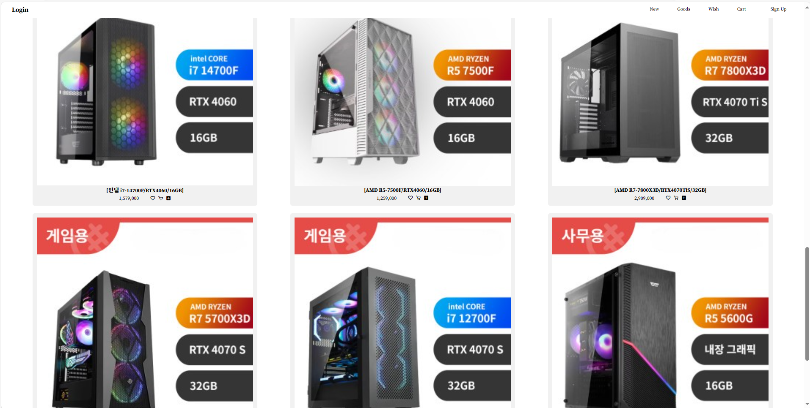

한정교 second project

---
## ✈ 배포주소

개발 버전 : version 1.0.0.0  
도메인 주소 : www.subal.shop  

## ✌️버전
| Version | Description | Date |
| --- | --- | --- |
| 0.1.1 | - VM 3Tier 서버 구축 | 2024.08.20 |
| 0.1.2 | - AWS 3Tier 서버 구축 | 2024.08.26 |
| 1.0.0 | - AWS 전체 구축 및 연동 완료 | 2024.08.30 |

## 🧑‍💻팀원 소개

| 이름 | 노현수 | 왕진우 | 김태형 |
| :------------: | :------------: | :------------: | :------------: |
|  |  |  |   |
| 깃허브 | [@watersooo](https://github.com/watersooo) | [@jinwoo0824](https://github.com/jinwoo0824) | [@kim1050](https://github.com/kim1050) |
| 역할 | Project Leader | Technology Leader | Engineer |
|  |  |  |  |

| 이름 | 김희준 | 송태훈 |
| :------------: | :------------: | :------------: |
|  |  |  |
| 깃허브 | [@heejun-ii](https://github.com/heejun-ii) | [@SongTaeHoon](https://github.com/SongTaeHoon) |
| 역할 | Engineer | Engineer |

## 📌 프로젝트 소개

### 프로젝트 기획 배경
1인 가구 증가와 원격 근무, 스마트 홈 기술 확산으로 늘어난 컴퓨터 기술 수요에 맞춰, 고객들이 최신 컴퓨터 부품을 쉽게 비교하고  
구매할 수 있는 플랫폼을 제공하여 변화하는 시장에 맞춘 다양한 제품과 정보를 통해 고객들이 최적의 선택을 할 수 있도록 도와 삶을 더욱 편리하게 지원하고자 합니다.  
이러한 배경에서 본 프로젝트를 기획하게 되었습니다.  
## 🛠기술 스택

<table>
<tr>
 <td align="center">클라우드 서비스</td>
 <td>
  
 </td>
</tr>
	
<tr>
 <td align="center">언어</td>
 <td>
  
  
   	 
  
 </td>
</tr>
	
<tr>
 <td align="center">프레임워크</td>
 <td>
   
</tr>

<tr>
 <td align="center">인프라</td>
 <td>
  
  
	
  
  
   
  
<tr>
 <td align="center">협업툴</td>
 <td>
    
    	 
    
     
 </td>
</tr>
<tr>
 <td align="center">기타</td>
 <td>
     
</tr>
</table>

## 🧱아키텍처

## 🗂홈페이지
--page

		

	

